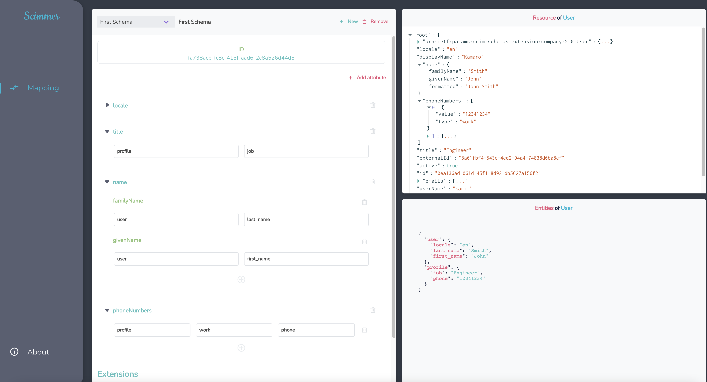

# Scimmer

Make SCIM resources mapping to entities easier and painless, by creating schemas and use them selectively.

## how to install

Scimmer is shipped as a docker image that you can pull: `elarouss/scimmer:<version>`
(use `elarouss/scimmer:latest` to get the latest version)

The container expects `DATABASE_URL` env variable (ex: `DATABASE_URL=postgresql://localhost:5432/postgres?user=postgres&password=`)

## how to use

### Create a schema

Scimmer comes with a UI wich you can use to create schemas to specify how to transform the SCIM resources to your desired entities format.
Here is an example:



### Transfrom SCIM resource to entities (When trying to Create or Update a resource):

You can do a `POST` request to the endpoint `/api/resource_to_entities`
The request body would be different depending on what you need:

1. Normal transform (for SCIM PUT for example)
   the body should be something like this:

```json
{
  "schemaId": <id of the schema to use>,
  "resource": {
    "locale": "en",
    "name": {
      "familyName": "Smith",
      "givenName": "John",
    },
    "phoneNumbers": [
      {
        "value": "12341234",
        "type": "work"
      }
    ],
    "title": "Engineer
  }
}
```

This will combine the entities into an SCIM Resource. the response example:
```json
  {
    "meta": {
      "schemaId": <id of the used schema>
    },
    "entities":
    {
      "user": {
        "locale": "en",
        "last_name": "Smith",
        "first_name": "John"
      },
      "profile": {
        "job": "Engineer",
        "phone": "12341234"
      }
    }
  }
```

2. Transform and Update through PATCH queries (for SCIM PATCH):
   the body should be something like this:

```json
{
  "schemaId": <id of the schema to user>,
  "entities": {
    "user": {
      "locale": "en",
      "last_name": "Smith",
      "first_name": "John"
    },
    "profile": {
      "job": "Engineer",
      "phone": "12341234"
    }
  },
  "patchReq": {
    "Operations": [
      {
        "op": "Replace",
        "path": "name.familyName",
        "value": "brown"
      },
      {
        "op": "replace",
        "path": "phoneNumbers[type eq \"work\"].value",
        "value": "010101010"
      }
    ]
  }
}
```

This will combine the entities into an SCIM Resource and apply the updates. response example:
```json
{
  "meta": {
    "schemaId": <id of the used schema>
  }, 
  "entities": {
    "user": {
      "locale": "en",
      "last_name": "brown",
      "first_name": "John"
    },
    "profile": {
      "job": "Engineer",
      "phone": "010101010"
    }
  }
}
```


### Transform entities Into SCIM Resource
You can do a `POST` request to the endpoint `/api/entities_to_resource`
The request body would be different depending on what you need:

1. One Resource (Useful with SCIM's GET requests)
  the body should be something like this:

```json
{
  "schemaId": <id of the schema to use>,
  "entities": {
    "user": {
      "locale": "en",
      "last_name": "Smith",
      "first_name": "John"
    },
    "profile": {
      "job": "Engineer",
      "phone": "12341234"
    }
  }
}
```

the response would be like:
```json
  {
    "meta": {
      "schemaId": <id of the used schema>
    },
    "resource": {
      "locale": "en",
      "name": {
        "familyName": "Smith",
        "givenName": "John",
      },
      "phoneNumbers": [
        {
          "value": "12341234",
          "type": "work"
        }
      ],
      "title": "Engineer
    }
  }
```

2. Many Resources 

the body should be something like this:
```json
{
  "schemaId": <id of the schema to use>,
  "entitiesList": [
    {
      "user": {
        "locale": "en",
        "last_name": "Smith",
        "first_name": "John"
      },
      "profile": {
        "job": "Engineer",
        "phone": "12341234"
      }
    }
  ]
}
```

the response would be like:
```json
  {
    "meta": {
      "schemaId": <id of the used schema>
    },
    "resources": [
      {
        "locale": "en",
        "name": {
          "familyName": "Smith",
          "givenName": "John",
        },
        "phoneNumbers": [
          {
            "value": "12341234",
            "type": "work"
          }
        ],
        "title": "Engineer"
      }
    ]
  }
```
### License

MIT License

Copyright (c) 2021 OUSSAMA EL ARBAOUI

Permission is hereby granted, free of charge, to any person obtaining a copy
of this software and associated documentation files (the "Software"), to deal
in the Software without restriction, including without limitation the rights
to use, copy, modify, merge, publish, distribute, sublicense, and/or sell
copies of the Software, and to permit persons to whom the Software is
furnished to do so, subject to the following conditions:

The above copyright notice and this permission notice shall be included in all
copies or substantial portions of the Software.

THE SOFTWARE IS PROVIDED "AS IS", WITHOUT WARRANTY OF ANY KIND, EXPRESS OR
IMPLIED, INCLUDING BUT NOT LIMITED TO THE WARRANTIES OF MERCHANTABILITY,
FITNESS FOR A PARTICULAR PURPOSE AND NONINFRINGEMENT. IN NO EVENT SHALL THE
AUTHORS OR COPYRIGHT HOLDERS BE LIABLE FOR ANY CLAIM, DAMAGES OR OTHER
LIABILITY, WHETHER IN AN ACTION OF CONTRACT, TORT OR OTHERWISE, ARISING FROM,
OUT OF OR IN CONNECTION WITH THE SOFTWARE OR THE USE OR OTHER DEALINGS IN THE
SOFTWARE.
